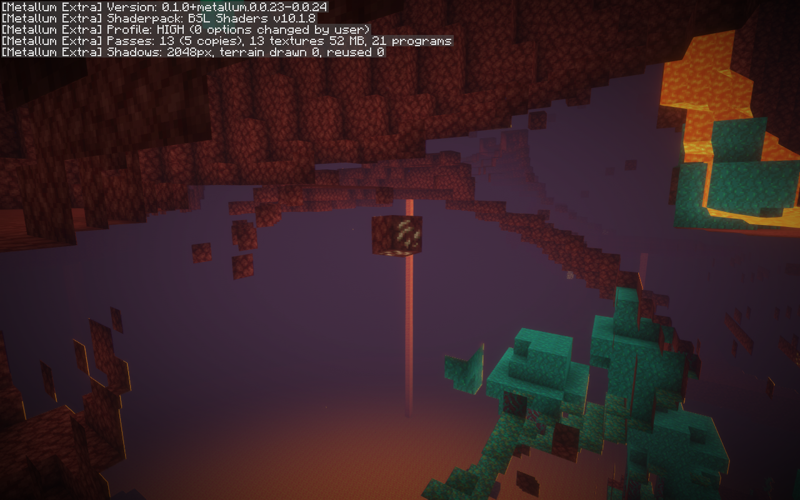
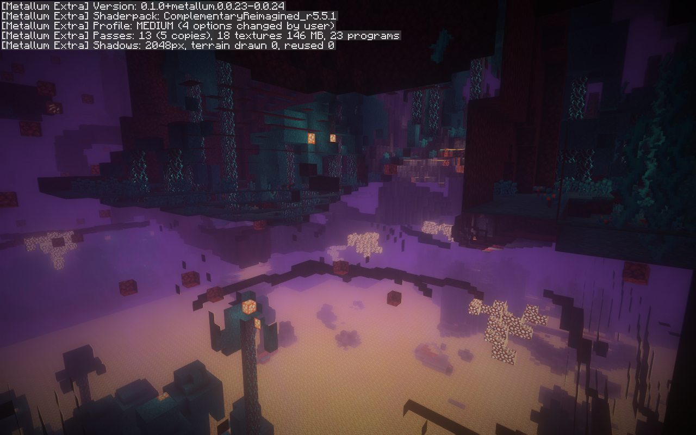

# Renderer smoke demo

These recorded captures show two standard shader-pack ZIPs applied through Metallum Extra's pack menu and rendered on Metallum's Metal backend. The on-screen status identifies the pack, selected profile, program count, and shadow-map setting. The images show Nether fog and emissive lava under each pack; shadow-map setup is visible in the status overlay. They are visual smoke-test captures, not a comparison against Iris and not proof that every effect or pass is correct.

## Captures

**BSL v10.1.8 — High profile, 21 programs reported:**

**Complementary Reimagined r5.5.1 — Medium profile, 23 programs reported:**

The pack and profile were changed in-game. Each pack was warmed up for 15 seconds, then measured for 40 seconds in the same Nether scene at 1280×800, render distance 8, simulation distance 5, with VSync off. The test machine reported an Apple M1 Pro; the run used Minecraft 26.2, Metallum 0.0.24, Sodium 0.9.2, and Metallum Extra `0.1.0+metallum.0.0.23-0.0.24`. The run was not pinned to a source commit, so it is development-build evidence rather than a result reproducible from the fork's current commit.

| Pack/profile | Average FPS | 1% low | p99 frame time |
|---|---:|---:|---:|
| BSL v10.1.8 / High | 315.8 | 247.2 | 3.81 ms |
| Complementary Reimagined r5.5.1 / Medium | 237.9 | 191.2 | 4.98 ms |

These are single-machine measurements from one fixed scene, not a general performance claim or a controlled Metal-versus-OpenGL comparison. They do not demonstrate all dimensions, options, or pack features.

## Compatibility limits shown by the test record

The smoke run confirms that these two pack configurations loaded and produced captured frames. It does not establish broad Iris compatibility. BSL v10.1.8 has a known `timeAngle` uniform mismatch in another run, and the compatibility table lists unsupported or partial features including compute and image operations, some shadow attachments, extra color buffers, entity identifiers, and parts of Iris's uniform/configuration APIs. See [the pack-by-pack compatibility table](translation-table.md) before treating another pack or profile as supported.

The recorded performance and image files were captured during development. Reproduce the architecture-only checks with `./gradlew architectureTest`; they run without Minecraft and do not reproduce this in-game demo.
